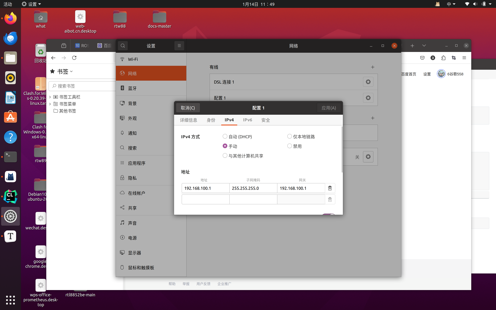

## 快速部署电脑（在电脑内核崩溃之后快速抢救措施）


### 关于驱动（无线网卡驱动):

​	天选5pro锐龙版的原厂驱动是RTL  8852be

​	驱动网址：https://gitcode.com/gh_mirrors/rt/rtl8852be/?utm_source=outstanding_ugc_gitcode&index=top&type=href&&isLogin=1

## 编译（适用于内核<5.18）

```bash
# 在BIOS中关闭安全启动

git clone https://github.com/HRex39/rtl8852be.git
cd rtl8852be
make -j8
sudo make install
sudo modprobe 8852be
```

## [     ](https://gitcode.com/gh_mirrors/rt/rtl8852be/?utm_source=outstanding_ugc_gitcode&index=top&type=href&&isLogin=1#编译（适用于内核≥518）)

## [     ](https://gitcode.com/gh_mirrors/rt/rtl8852be/?utm_source=outstanding_ugc_gitcode&index=top&type=href&&isLogin=1#编译（适用于内核≥518）)编译（适用于内核≥5.18）

```bash
# 在BIOS中关闭安全启动

git clone https://github.com/HRex39/rtl8852be.git -b dev
cd rtl8852be
make -j8
sudo make install
sudo modprobe 8852be
```

然后驱动一般就没有问题了


安装Clion:https://www.kdun.com/ask/1323985.html

安装ros（noetic）：

```bash
wget http://fishros.com/install -O fishros && . fishros
```

安装Git:

```bash
sudo apt-get install git

git config --global user.name "What_help"
git config --global user.email 3351730846@qq.com
```


安装cmake：

```
sudo apt install cmake
```

 如果找不到的话


```
sudo apt update
sudo apt upgrade
```


安装rqt,rviz,plotjuggler:

```bash
sudo apt-get install ros-noetic-rqt

sudo apt-get install ros-noetic-rviz

sudo apt-get install ros-noetic-plotjuggler
```


一键补全工作空间依赖：

```bash
rosdep install --from-paths src -i -r
```


梯子：

百度网盘

订阅地址：https://a.banana-speed01.com/subscribe?token=gXlxGt1cKRdeJpbi&type=clash


星火应用商店：百度网盘


调车设置：



.bashrc 配置见：关于调电机

